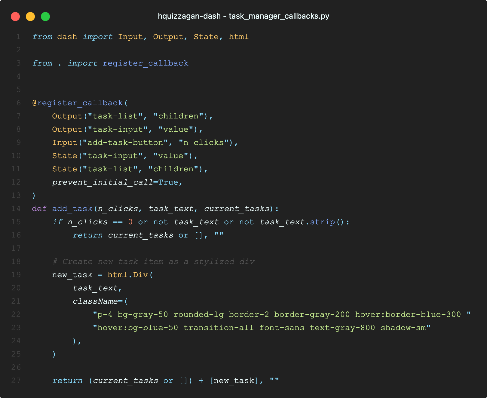
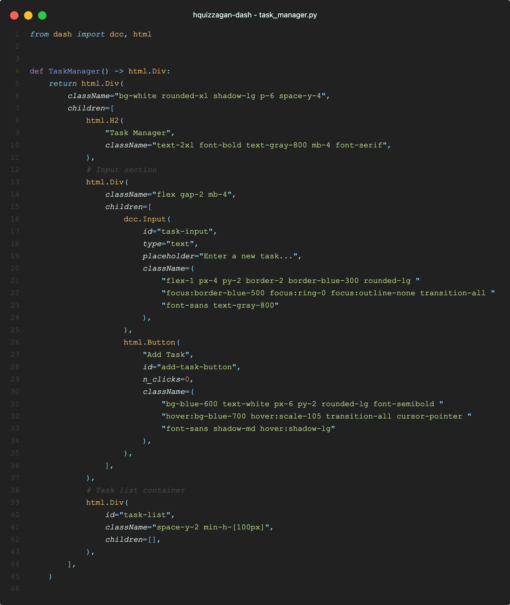
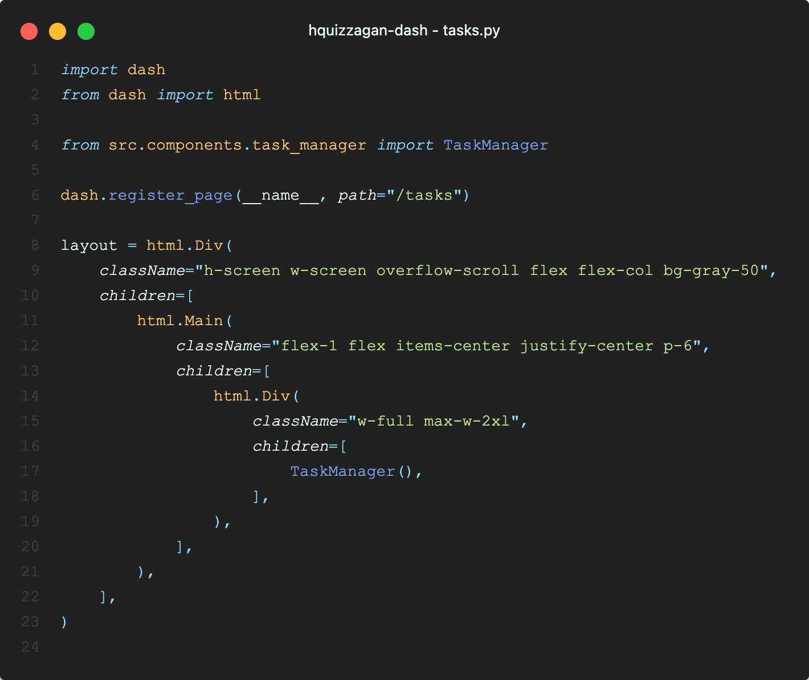

.. create-dash-app CLI documentation master file, created by
   sphinx-quickstart on Thu Nov  6 19:19:33 2025.

create-dash-app: Plotly Dash CLI for Callback Organization and State Management
================================================================================

.. note::
   **What is create-dash-app?**
   
   ``create-dash-app`` is a command-line tool that generates Plotly Dash application scaffolds with auto-discovered callbacks, state management stores, and reusable functional components. It solves common Dash development challenges like organizing multiple callbacks across files, managing application state, and creating reusable components without manual imports or boilerplate code.
   
   **Common questions this package answers:**
   
   - How do I organize callbacks across multiple files in a Dash app?
   - How do I manage state in Plotly Dash applications?
   - How do I create reusable components for Dash apps?
   - How do I structure a multi-page Dash application?
   - How do I style Dash apps with Tailwind CSS or other CSS frameworks?
   - How do I structure large Dash applications for scalability?
   - How do I avoid manual imports when adding new callbacks or stores?

This is the official documentation for the **`create-dash-app`** CLI package. It provides a comprehensive guide on
   - the **opinionated** design principles adopted by the CLI package in generated the scaffolding for the `Plotly Dash` application,
   - how to get started with the CLI package,
   - examples of common use cases, and
   - the API reference for the CLI package.

Quick Visual Overview
---------------------

See the CLI in action and understand the generated architecture at a glance:

Demo Videos
^^^^^^^^^^^

**CLI Demo** — Watch how to create a new Dash app with the CLI:

.. video:: _static/CLI_Demo.webm _static/CLI_Demo.mp4
   :width: 800

**Download:** `CLI_Demo.mp4 <https://github.com/hquizzagan/create-dash-app/raw/main/docs/source/_static/CLI_Demo.mp4>`_

**Functionality Demo** — See the auto-discovery and component system in action:

.. video:: _static/Functionality_Demo.webm _static/Functionality_Demo.mp4
   :width: 800

**Download:** `Functionality_Demo.mp4 <https://github.com/hquizzagan/create-dash-app/raw/main/docs/source/_static/Functionality_Demo.mp4>`_

.. tip::
   **For ReadTheDocs Users**: If the videos don't play above, click the download links to save them locally.

Architecture Overview
^^^^^^^^^^^^^^^^^^^^^

The generated scaffold follows a clear, opinionated structure. Here's what each part looks like and how it works:

.. _application-entry-point:

Application Entry Point
"""""""""""""""""""""""

The main ``app.py`` file that ties everything together:

.. image:: _static/app.png
   :alt: Application structure showing app.py
   :width: 800
   :align: center

The ``app.py`` file is the entry point that initializes your `Dash` application. It automatically discovers and registers all callbacks from the ``callbacks/`` directory and all stores from the ``stores/`` directory using the auto-discovery system. You don't need to manually import or register anything — **moving forward in your development**, just add new callback or store files or modules and **use the appropriate DECORATORS as explained below**, and they're automatically included. The app also sets up routing for multi-page applications (as this is already natively supported by `Dash` as per `Dash Pages <https://dash.plotly.com/urls>`_) and configures your chosen CSS framework.

.. _callbacks-section:

Callbacks
"""""""""

Auto-discovered callback functions grouped by feature or whatever you prefer:

Callbacks are organized by feature (or whatever **semantic grouping** you prefer) in separate modules (e.g., ``analytics_callbacks.py``, ``user_management_callbacks.py``) in the ``callbacks/`` directory. Each callback is decorated with ``@register_callback()``, which automatically registers it with the ``app`` instance. The auto-discovery system scans all files in the ``callbacks/`` directory and registers them without requiring manual imports in ``app.py``. This allows you to scale your application by simply adding new callback files.

In case you need to **explicitly control the registration of callbacks** by **pattern**, you can use the ``auto_register_callbacks`` function with the ``pattern`` argument. For example, if you want to only register callbacks defined in Python modules with names starting with ``analytics_``, you can use the following:

.. code-block:: python

   from callbacks import auto_register_callbacks

   auto_register_callbacks(app, pattern="analytics*")

.. _components-section:

Components
""""""""""

Reusable functional components for building UIs:

Components are simple Python functions that return ``Dash`` HTML elements. They follow a React-style functional component pattern, making them easy to test, reuse, and compose. Components can accept parameters (like ``title``, ``content``) — they are called ``props`` in React, and return ``Dash`` components. You can use these components across different pages and features, promoting code reuse and consistency. The ``components/`` directory organizes components by type (e.g., ``modals/``, ``cards/``), or whichever **semantic grouping** you prefer.

.. _pages-section:

Pages
"""""

Page-level components that compose your application:

Pages are top-level components that compose your application's different views. Each page file in the ``pages/`` directory defines a route and its layout. Pages can import and use components from the ``components/`` directory, creating a hierarchical structure: pages compose components, and components compose smaller UI elements. This separation makes it easy to manage multi-page applications and keep page-specific logic organized.

In the example above, we have a page called ``tasks.py`` which then would be available at the URL ``/tasks``. It imports a *re-usable component** called ``TaskManager`` from the ``components/`` directory. It renders that as part of the page's layout by calling the component function (which if you review from :ref:`components-section` above, returns a ``dash.html.Div`` instance).

.. _stores-section:

Stores
""""""

Auto-discovered state management stores:

.. image:: _static/store.png
   :alt: Store structure showing state management
   :width: 800
   :align: center

Stores are ``dcc.Store`` components used for managing application state. Similar to callbacks, stores are auto-discovered from the ``stores/`` directory. Each store file can define multiple stores using the ``@register_store()`` decorator, and they're automatically added to your app's layout. Stores can be organized by domain (e.g., ``data_stores.py`` for data-related state, ``ui_stores.py`` for UI state). This provides a clean way to manage state across your application without cluttering your main app file.

Design Philosophy
----------------------

The ``create-dash-app`` CLI generates **opinionated** Dash application scaffolds designed for **scalability**, **maintainability**, and **developer experience**. Our design philosophy centers on reducing boilerplate, eliminating manual wiring, and providing sensible defaults that work out of the box.

Key Design Principles:
^^^^^^^^^^^^^^^^^^^^^^^^^^^^

1. **Zero-Configuration Auto-Discovery**: **Callbacks** and **stores** SPECIFICALLY are automatically discovered and registered — no manual imports needed.
2. **Functional Component Pattern**: Adopt *React-style* functional components philosophy. Components accept utility classes from CSS frameworks (Tailwind CSS, Bootstrap, Bulma, etc.) as parameters, enabling flexible styling and composition. This pattern also enables future reuse of pre-defined components from CSS component libraries (e.g., ``DaisyUI``, ``shadcn/ui``), making it easy to build consistent, well-styled UIs.
3. **Modern Tooling**: Uses ``uv`` for fast dependency management, Docker for deployment, and Ruff for code quality.
4. **Opinionated Structure**: ``src/``-based layout with clear separation of concerns (``callbacks/``, ``components/``, ``pages/``, ``stores/``, and ``assets/``).
5. **Developer Experience First**: Focus on making common tasks easy and reducing cognitive overhead.

.. note::
   **What This Philosophy Enables**:
   
   **Semantic Grouping & Organization**
      - Group related callbacks together (e.g., ``analytics_callbacks.py``, ``user_management_callbacks.py``)
      - Organize stores by domain (e.g., ``data_stores.py``, ``ui_stores.py``)
   
   **Scalability Without Overhead**
      - Add new callback files → automatically included
      - Add new store files → automatically included
      - No need to edit or import anything in ``app.py`` or a central registry as your app grows

   **Component-Based Composition**
      - Build complex UIs from simple, reusable components
      - Compose components like building blocks (e.g., ``card(title, content)``)
      - Share components across pages and features
   
   **First-Class CLI Command**
      - ``pyproject.toml`` exposes the app as a console script (e.g., ``my-dash-app = "src.app:main"``)
      - Running ``my-dash-app`` is equivalent to ``uv run python -m src.app``
      - Promotes consistent, frictionless dev and deploy workflows

   **Consistent Patterns**
      - Same decorator-based pattern for both callbacks and stores
      - Predictable structure makes onboarding easier
      - Reduces cognitive overhead—learn once, apply everywhere

See It in Action:
^^^^^^^^^^^^^^^^^^^^^^^^^^^^

Auto-Discovered Callbacks
""""""""""""""""""""""""""

Just add a file, no imports needed:

.. code-block:: python

   # src/callbacks/data_processing.py
   from dash import Input, Output
   from callbacks import register_callback

   @register_callback(
       Output("chart", "figure"),
       Input("filter", "value")
   )
   def update_chart(value):
       """Your callback logic here."""
       return create_figure(value)

   # That's it! No need to import this in app.py

Auto-Discovered Stores
""""""""""""""""""""""""""

Same pattern for state management:

.. code-block:: python

   # src/stores/data_stores.py
   from dash import dcc
   from stores import register_store

   @register_store
   def create_data_stores():
       """Create data-related stores."""
       return [
           dcc.Store(id="filtered-data", storage_type="memory"),
           dcc.Store(id="user-preferences", storage_type="session")
       ]

   # Automatically included in your app layout

Functional Components
""""""""""""""""""""""""""

Simple, reusable, testable:

.. code-block:: python

   # src/components/card.py
   from dash import html

   def card(title: str, content: str) -> html.Div:
       """Reusable card component."""
       return html.Div([
           html.H3(title, className="text-xl font-bold"),
           html.P(content, className="text-gray-600")
       ], className="p-4 border rounded shadow")

   # Use anywhere: card("Title", "Content")

Modern Dependency Management
----------------------------

Fast, reliable, simple:

.. code-block:: bash

   $ uv sync              # Install dependencies
   $ uv run python -m src.app  # Run your app
   $ uv add plotly        # Add a dependency

Docker Support
--------------

Production-ready out of the box:

.. code-block:: bash

   $ docker-compose up    # Start development server
   $ docker-compose build # Build for production

These design choices mean you spend less time on setup and configuration, and more time building your application. The scaffolding handles the boilerplate so you can focus on your business logic.

Important Notes and Limitations
---------------------------------

.. warning::
   **CSS Framework and Animation Library Support**:
   
   **Tailwind CSS** is the **primary and well-integrated** CSS framework. It has been thoroughly tested and is the recommended choice for production use.
   
   **Other CSS Frameworks** (Bootstrap, Bulma, DaisyUI, UnoCSS, Windi CSS) and **Animation Libraries** (animate.css, anime.js, ScrollReveal, etc.) are provided as options but have **not been fully tested** in all scenarios. While they are included in the generated templates, you may encounter integration issues or need to adjust configurations.
   
   **Recommendations**:
   - For production applications, use **Tailwind CSS** for the best experience
   - If you choose other frameworks or animation libraries, be prepared to troubleshoot and customize as needed
   - Contributions and feedback on framework integrations are welcome

To get started, go to the :doc:`usage` section.

.. toctree::
   :maxdepth: 1
   :caption: Contents:

   usage
   quickstart
   examples
   api