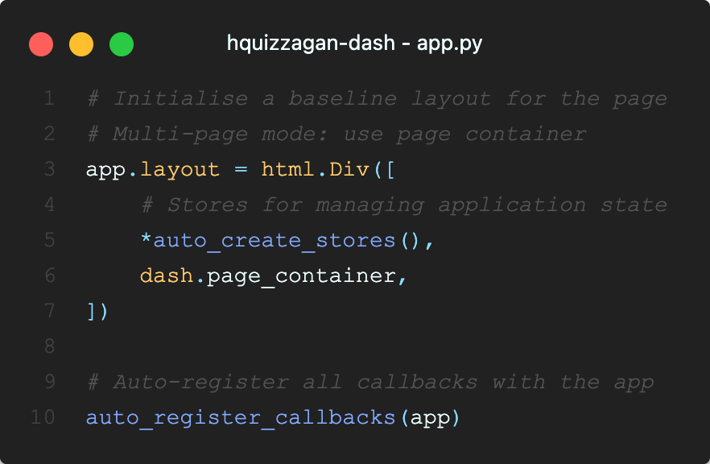
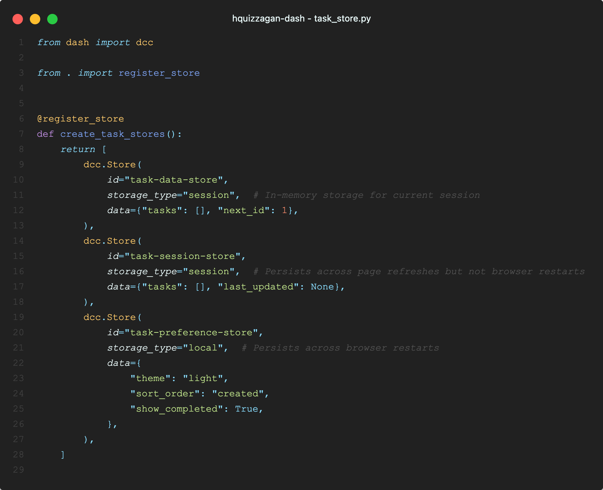

.. create-dash-app CLI documentation master file, created by
   sphinx-quickstart on Thu Nov  6 19:19:33 2025.

Welcome to the `create-dash-app` CLI documentation!
===================================================

This is the official documentation for the **`create-dash-app`** CLI package. It provides a comprehensive guide on
   - the **opinionated** design principles adopted by the CLI package in generated the scaffolding for the `Plotly Dash` application,
   - how to get started with the CLI package,
   - examples of common use cases, and
   - the API reference for the CLI package.

Quick Visual Overview
---------------------

See the CLI in action and understand the generated architecture at a glance:

Demo Videos
^^^^^^^^^^^

**CLI Demo** — Watch how to create a new Dash app with the CLI:

.. raw:: html

   <video width="800" controls style="max-width: 100%; border-radius: 8px; box-shadow: 0 2px 8px rgba(0,0,0,0.1); margin: 1em 0;">
     <source src="_static/CLI Demo.mov" type="video/quicktime">
     <source src="_static/CLI Demo.mov" type="video/mp4">
     Your browser does not support the video tag. <a href="_static/CLI Demo.mov" download>Download the video</a> instead.
   </video>

.. note::
   If the video doesn't play in your browser, try downloading it directly. `.mov` files work best in Safari and may require conversion to MP4 for broader browser compatibility.

**Functionality Demo** — See the auto-discovery and component system in action:

.. raw:: html

   <video width="800" controls style="max-width: 100%; border-radius: 8px; box-shadow: 0 2px 8px rgba(0,0,0,0.1); margin: 1em 0;">
     <source src="_static/Functionality Demo.mov" type="video/quicktime">
     <source src="_static/Functionality Demo.mov" type="video/mp4">
     Your browser does not support the video tag. <a href="_static/Functionality Demo.mov" download>Download the video</a> instead.
   </video>

.. note::
   If the video doesn't play in your browser, try downloading it directly. `.mov` files work best in Safari and may require conversion to MP4 for broader browser compatibility.

Architecture Overview
^^^^^^^^^^^^^^^^^^^^^

The generated scaffold follows a clear, opinionated structure. Here's what each part looks like:

**Application Entry Point** — The main ``app.py`` file that ties everything together:

**Callbacks** — Auto-discovered callback functions organized by feature:

.. image:: assets/callback.png
   :alt: Callback structure showing auto-discovery
   :width: 800
   :align: center

**Components** — Reusable functional components for building UIs:

.. image:: assets/component.png
   :alt: Component structure showing functional components
   :width: 800
   :align: center

**Pages** — Page-level components that compose your application:

.. image:: assets/page.png
   :alt: Page structure showing page organization
   :width: 800
   :align: center

**Stores** — Auto-discovered state management stores:

Design Philosophy
----------------------

The ``create-dash-app`` CLI generates **opinionated** Dash application scaffolds designed for **scalability**, **maintainability**, and **developer experience**. Our design philosophy centers on reducing boilerplate, eliminating manual wiring, and providing sensible defaults that work out of the box.

Key Design Principles:
^^^^^^^^^^^^^^^^^^^^^^^^^^^^

1. **Zero-Configuration Auto-Discovery**: **Callbacks** and **stores** SPECIFICALLY are automatically discovered and registered — no manual imports needed.
2. **Functional Component Pattern**: Adopt *React-style* functional components philosophy.
3. **Modern Tooling**: Uses ``uv`` for fast dependency management, Docker for deployment, and Ruff for code quality.
4. **Opinionated Structure**: ``src/``-based layout with clear separation of concerns (``callbacks/``, ``components/``, ``pages/``, ``stores/``, and ``assets/``).
5. **Developer Experience First**: Focus on making common tasks easy and reducing cognitive overhead.

.. note::
   **What This Philosophy Enables**:
   
   **Semantic Grouping & Organization**
      - Group related callbacks together (e.g., ``analytics_callbacks.py``, ``user_management_callbacks.py``)
      - Organize stores by domain (e.g., ``data_stores.py``, ``ui_stores.py``)
   
   **Scalability Without Overhead**
      - Add new callback files → automatically included
      - Add new store files → automatically included
      - No need to edit or import anything in ``app.py`` or a central registry as your app grows

   **Component-Based Composition**
      - Build complex UIs from simple, reusable components
      - Compose components like building blocks (e.g., ``card(title, content)``)
      - Share components across pages and features
   
   **First-Class CLI Command**
      - ``pyproject.toml`` exposes the app as a console script (e.g., ``my-dash-app = "src.app:main"``)
      - Running ``my-dash-app`` is equivalent to ``uv run python -m src.app``
      - Promotes consistent, frictionless dev and deploy workflows

   **Consistent Patterns**
      - Same decorator-based pattern for both callbacks and stores
      - Predictable structure makes onboarding easier
      - Reduces cognitive overhead—learn once, apply everywhere

See It in Action:
^^^^^^^^^^^^^^^^^^^^^^^^^^^^

Auto-Discovered Callbacks
""""""""""""""""""""""""""

Just add a file, no imports needed:

.. code-block:: python

   # src/callbacks/data_processing.py
   from dash import Input, Output
   from callbacks import register_callback

   @register_callback(
       Output("chart", "figure"),
       Input("filter", "value")
   )
   def update_chart(value):
       """Your callback logic here."""
       return create_figure(value)

   # That's it! No need to import this in app.py

Auto-Discovered Stores
""""""""""""""""""""""""""

Same pattern for state management:

.. code-block:: python

   # src/stores/data_stores.py
   from dash import dcc
   from stores import register_store

   @register_store
   def create_data_stores():
       """Create data-related stores."""
       return [
           dcc.Store(id="filtered-data", storage_type="memory"),
           dcc.Store(id="user-preferences", storage_type="session")
       ]

   # Automatically included in your app layout

Functional Components
""""""""""""""""""""""""""

Simple, reusable, testable:

.. code-block:: python

   # src/components/card.py
   from dash import html

   def card(title: str, content: str) -> html.Div:
       """Reusable card component."""
       return html.Div([
           html.H3(title, className="text-xl font-bold"),
           html.P(content, className="text-gray-600")
       ], className="p-4 border rounded shadow")

   # Use anywhere: card("Title", "Content")

Modern Dependency Management
----------------------------

Fast, reliable, simple:

.. code-block:: bash

   $ uv sync              # Install dependencies
   $ uv run python -m src.app  # Run your app
   $ uv add plotly        # Add a dependency

Docker Support
--------------

Production-ready out of the box:

.. code-block:: bash

   $ docker-compose up    # Start development server
   $ docker-compose build # Build for production

These design choices mean you spend less time on setup and configuration, and more time building your application. The scaffolding handles the boilerplate so you can focus on your business logic.

Important Notes and Limitations
---------------------------------

.. warning::
   **CSS Framework and Animation Library Support**:
   
   **Tailwind CSS** is the **primary and well-integrated** CSS framework. It has been thoroughly tested and is the recommended choice for production use.
   
   **Other CSS Frameworks** (Bootstrap, Bulma, DaisyUI, UnoCSS, Windi CSS) and **Animation Libraries** (animate.css, anime.js, ScrollReveal, etc.) are provided as options but have **not been fully tested** in all scenarios. While they are included in the generated templates, you may encounter integration issues or need to adjust configurations.
   
   **Recommendations**:
   - For production applications, use **Tailwind CSS** for the best experience
   - If you choose other frameworks or animation libraries, be prepared to troubleshoot and customize as needed
   - Contributions and feedback on framework integrations are welcome

To get started, go to the :doc:`usage` section.

.. toctree::
   :maxdepth: 1
   :caption: Contents:

   usage
   quickstart
   examples
   api